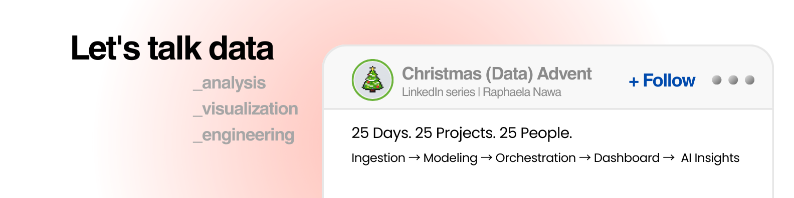

# Christmas Data Advent 2025
### 25 Real Automation Projects in 25 Days

I'm Raphaela Nawa - BI Specialist and Data Engineer building real data pipelines for real people.

All I want for Christmas is for us to use this AI hype to have more human quality time.
So I built 25 real data automations — one per day — each one designed as a data gift for someone I admire.
Each one tackles a real problem.
Each one eliminates manual work that drains hours.
Each one ships with full code and documentation.

→ **Ingestion** (Dec 1–5): API pipelines
→ **Modeling** (Dec 6–10): dbt, metrics layers
→ **Orchestration** (Dec 11–15): Airflow, monitoring
→ **Dashboards** (Dec 16–20): Looker Studio, visualization
→ **AI Insights** (Dec 21–25): LLM-powered analysis

---

## The Projects

| Day | Pillar | Project | Industry | Status | Code |
|-----|--------|---------|----------|--------|------|
| 1 | Ingestion | GA4 + Google Ads → BigQuery Pipeline | Product Launch | ✅ Complete | [Day 01](./day01) |
| 2 | Ingestion | Creator Intelligence System | TBD | ✅ Complete | [Day 02](./day02) |
| 3 | Ingestion | TBD | TBD | ✅ Complete | [Day 03](./day03) |
| 4 | Ingestion | TBD | TBD | ✅ Complete | [Day 04](./day04) |
| 5 | Ingestion | Museu Ipiranga Cultural Data Pipeline | TBD | ✅ Complete | [Day 05](./day05) |
| 6 | Modeling | SaaS Health Metrics Foundation | TBD | ✅ Complete | [Day 06](./day06) |
| 7 | Modeling | Hospitality LTV & Cohort Model | TBD | ✅ Complete | [Day 07](./day07) |
| 8 | Modeling | SaaS Growth Funnel & Cohort Analysis (dbt) | TBD | ✅ Complete | [Day 08](./day08) |
| 9 | Modeling | TBD | TBD | 🚧 Planned | [Day 09](./day09) |
| 10 | Modeling | TBD | TBD | 🚧 Planned | [Day 10](./day10) |
| 11 | Orchestration | TBD | TBD | 🚧 Planned | [Day 11](./day11) |
| 12 | Orchestration | TBD | TBD | 🚧 Planned | [Day 12](./day12) |
| 13 | Orchestration | TBD | TBD | 🚧 Planned | [Day 13](./day13) |
| 14 | Orchestration | TBD | TBD | 🚧 Planned | [Day 14](./day14) |
| 15 | Orchestration | TBD | TBD | 🚧 Planned | [Day 15](./day15) |
| 16 | Dashboards | TBD | TBD | 🚧 Planned | [Day 16](./day16) |
| 17 | Dashboards | TBD | TBD | 🚧 Planned | [Day 17](./day17) |
| 18 | Dashboards | TBD | TBD | 🚧 Planned | [Day 18](./day18) |
| 19 | Dashboards | TBD | TBD | 🚧 Planned | [Day 19](./day19) |
| 20 | Dashboards | TBD | TBD | 🚧 Planned | [Day 20](./day20) |
| 21 | AI Insights | TBD | TBD | 🚧 Planned | [Day 21](./day21) |
| 22 | AI Insights | TBD | TBD | 🚧 Planned | [Day 22](./day22) |
| 23 | AI Insights | TBD | TBD | 🚧 Planned | [Day 23](./day23) |
| 24 | AI Insights | TBD | TBD | 🚧 Planned | [Day 24](./day24) |
| 25 | AI Insights | TBD | TBD | 🚧 Planned | [Day 25](./day25) |

---

## About This Project

This repository contains 25 production-ready data automation projects, each designed to solve real business problems for real people. Every project is:

- **Practical**: Tackles an actual pain point for someone I know
- **Complete**: Full working code with documentation
- **Educational**: Explains the "why" not just the "how"
- **Free to use**: Open source for anyone to learn from or adapt

### Philosophy

In the age of AI hype, my goal is simple: **use automation to give people back their time**. Each project eliminates hours of manual work so people can focus on what matters most.

---

## Getting Started

### Prerequisites

- Python 3.11+
- Google Cloud Platform account (free tier works for most projects)
- Basic familiarity with command line

### Installation

```bash
# Clone the repository
git clone https://github.com/raphaela-nawa/advent-automation-2025.git
cd advent-automation-2025

# Install dependencies
pip install -r requirements.txt

# Set up configuration
cp config/.env.example config/.env
# Edit config/.env with your credentials
```

### Running a Project

Each day's project is self-contained in its own directory:

```bash
cd day01
python day01_DATA_extract_ga4.py
python day01_DATA_extract_ads.py
python day01_DATA_load_bigquery.py
```

See each project's README for specific instructions.

---

## Project Structure

```
advent-automation-2025/
├── day01/          # GA4 + Google Ads → BigQuery
├── day02/          # Coming soon...
├── ...
├── day25/          # Final project
├── common/         # Shared utilities
├── config/         # Environment configuration
└── requirements.txt
```

---

## Contributing

This is a personal project, but I welcome:
- Bug reports
- Suggestions for improvements
- Questions about implementation

Please open an issue if you find something that could be better!

---

## License

MIT License - feel free to use this code for learning or in your own projects.

---

## Connect

- GitHub: [@raphaela-nawa](https://github.com/raphaela-nawa)
- Follow along: A new project drops every day in December 2025

---

**Built with data, automation, and a desire to give time back to the people I care about.**
