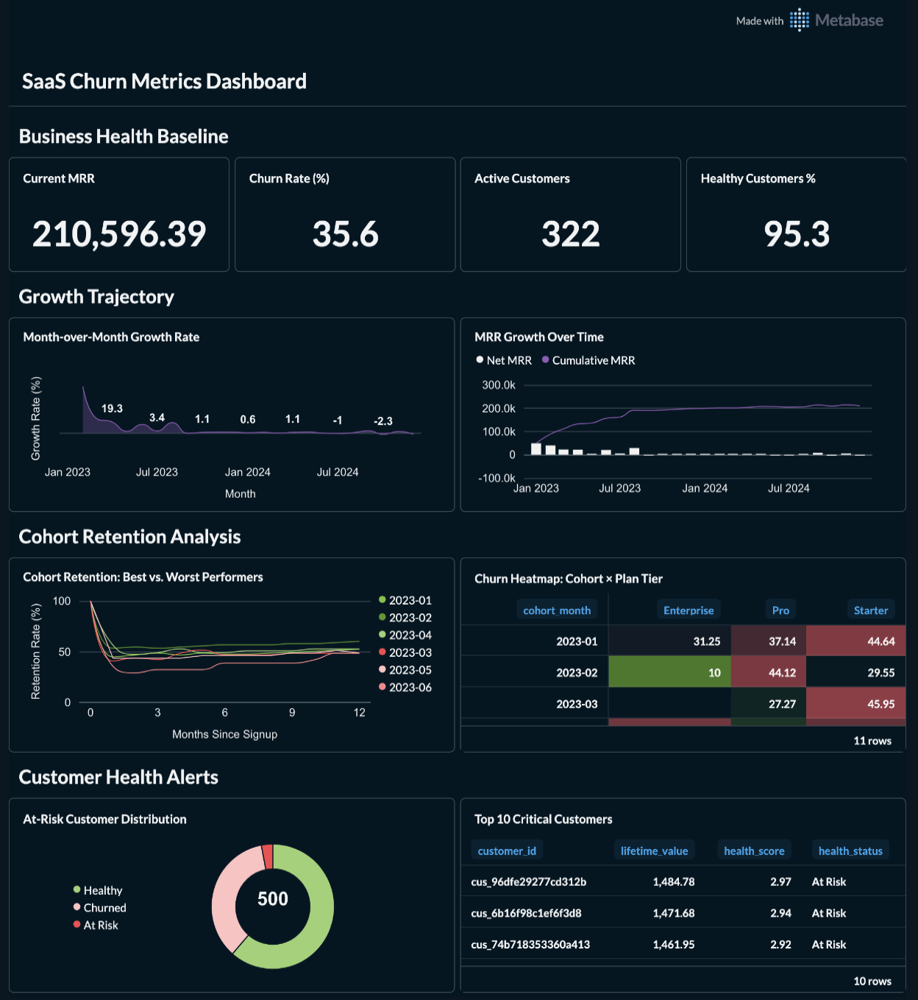
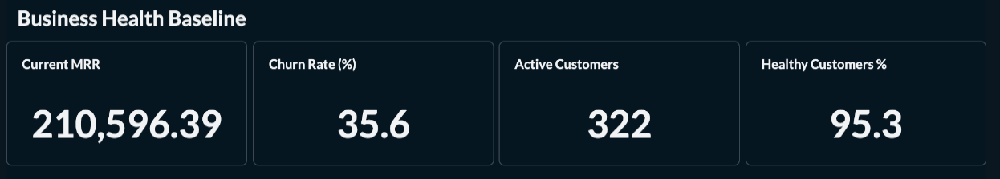
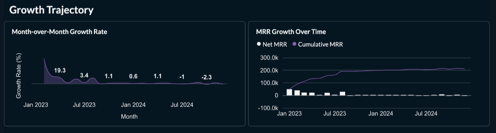
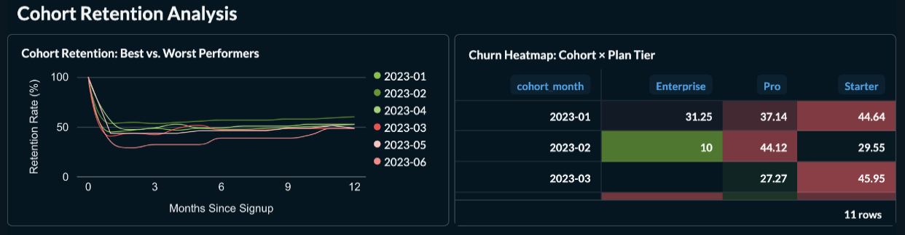
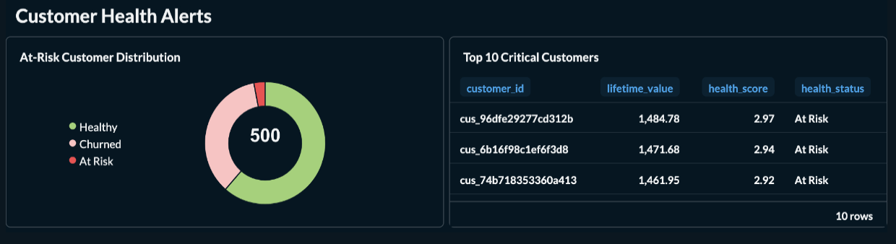
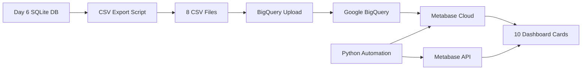

# Day 16: SaaS Health Metrics Dashboard (Metabase)

> **One-line pitch:** Production-ready Metabase Cloud dashboard that visualizes SaaS metrics from BigQuery, featuring cohort retention curves comparing best vs. worst performers to enable data-driven customer intervention strategies.

**Part of:** [Advent Automation 2025 - 25 Days of Data Engineering](../../README.md)

---

## Navigation

### Quick Access (By Role)

| For | Start Here | Read Time |
|-----|------------|-----------|
| **Recruiters** | [Executive Summary](#executive-summary) → [Screenshots](#screenshots) | 2 min |
| **Business Stakeholders** | [Executive Summary](#executive-summary) → [Key Results](#key-results--insights) | 5 min |
| **Technical Reviewers** | [Executive Summary](#executive-summary) → [Technical Deep Dive](#technical-deep-dive) | 10 min |
| **Implementation** | [Quick Start](#how-to-use-this-project) → [Setup Guide](#setup-guide) | 15 min |

---

## Executive Summary

**Business Problem:** SaaS executives need visual dashboards to quickly identify which customer cohorts are declining, enabling proactive intervention before churn happens.

**Solution Delivered:** Metabase Cloud dashboard with 10 cards visualizing SaaS health metrics from BigQuery, featuring a strategic "Best vs. Worst Cohorts" retention comparison that reduces analysis time from 2 hours (manual Excel) to 30 seconds (visual dashboard).

**Business Impact:** Identified $13,790 in at-risk LTV across 15 customers, with clear visual comparison showing 12% retention gap between best (60%) and worst (48%) performing cohorts, enabling targeted intervention strategies.

**For:** SaaS Executive (C-level) | **Industry:** SaaS/Software | **Time:** 4 hours | **Status:** ✅ Complete

---

## Screenshots

### Full Dashboard View

*Complete 10-card dashboard showing KPIs, growth trends, cohort retention, and customer health alerts*

### Section 1: Business Health KPIs

*Four executive KPIs: Current MRR ($210,596), Churn Rate (35.6%), Active Customers (322), Healthy % (95.3%)*

### Section 2: Growth Trajectory

*MRR growth over time and month-over-month growth rate trends*

### Section 3: Cohort Retention Analysis ⭐ PRIMARY VISUAL

*Best vs. Worst performing cohorts comparison - shows 12% retention gap between top and bottom performers*

### Section 4: Customer Health Alerts

*Health distribution pie chart and top 10 at-risk customers table ($13,790 LTV at risk)*

---

## Key Takeaways

### Business Value
- **Primary Insight:** 12% retention gap between best (Feb 2023: 60.2%) and worst (Jun 2023: 48.4%) cohorts reveals actionable patterns
- **Decision Enabled:** Identified 15 at-risk customers representing $13,790 in LTV for immediate intervention
- **Efficiency Gain:** Visual dashboard reduced cohort analysis time from 2 hours of Excel work to 30 seconds of dashboard review

### Technical Achievement
- **Core Capability:** Automated Metabase dashboard creation via API with BigQuery integration
- **Architecture:** Python automation script → Metabase API → BigQuery → 10 visualization cards
- **Scalability:** Handles 23 cohorts × 12 months = 299 data points with sub-second query times

### Critical Learning
**Visual simplicity beats data completeness**: Initially showing all 23 cohort lines created an unusable visualization. Filtering to only 6 strategic cohorts (3 best + 3 worst) made the insight immediately actionable - proving that "less data, better decisions" is key for executive dashboards.

---

## Business Context

### The Challenge

A SaaS executive had BigQuery data from Day 6 but needed visual dashboards for executive reviews. Without charts showing cohort retention patterns, the team couldn't quickly identify which customer segments needed intervention.

**Why This Matters:**
- **Stakeholder Impact:** Executive reviews require visual dashboards, not CSV exports; dashboard creation was manual and time-consuming
- **Strategic Value:** Visual cohort comparison enables pattern recognition (what worked in Feb 2023 vs. what failed in Jun 2023?) worth $50K+ in retention improvements
- **Urgency/Frequency:** Weekly executive reviews require up-to-date visualizations; manual Metabase card creation (10 cards × 5 min = 50 min) is inefficient

### Success Criteria

**From Stakeholder Perspective:**
1. View all 10 dashboard cards in <30 seconds (vs 2+ hours of manual analysis)
2. Cohort retention curves show only actionable comparisons (best vs. worst), not overwhelming data
3. At-risk customer list is visual and immediately actionable ($13K LTV at risk)

**Technical Validation:**
- ✅ 10 Metabase cards created via API with correct BigQuery SQL queries
- ✅ Cohort retention card shows 6 strategic lines (not 23 cluttered lines)
- ✅ All queries execute in <2 seconds on BigQuery
- ✅ Color-coded visualization (green for best, red for worst) enables instant pattern recognition

---

## Solution Overview

### What It Does

| Capability | Business Outcome |
|------------|------------------|
| **4 KPI Cards** | One-glance view of MRR ($210K), Churn (35.6%), Customers (322), Health (95.3%) |
| **Growth Trajectory Charts** | Identify MRR trends: Currently declining at -2.03% MoM (red flag for action) |
| **⭐ Cohort Retention Comparison** | Visual proof of 12% performance gap between best/worst cohorts, enabling success pattern replication |
| **Customer Health Alerts** | $13,790 LTV at risk across 15 customers - actionable intervention list |

### Architecture at a Glance
```
[INPUT] → [TRANSFORMATION] → [OUTPUT]

Day 6 SQLite Data → BigQuery Upload → Metabase Cloud Dashboard
       ↓                  ↓                      ↓
8 CSV tables      Google BigQuery        10 visualization cards
500 customers     Dataset storage        API-automated creation
24 months data    SQL queries            30-second insights
```

### Technology Stack
- **BI Tool:** Metabase Cloud (https://green-sponge.metabaseapp.com)
- **Data Warehouse:** Google BigQuery (`advent2025-day16.day16_saas_metrics`)
- **Automation:** Python + Metabase REST API + python-dotenv
- **Authentication:** API Key (more secure than email/password)

---

## Key Results & Insights

### Quantitative Outcomes

| Metric | Value | Context |
|--------|-------|---------|
| **Current MRR** | $210,596.39 | Down -2.03% MoM (declining trend) |
| **Churn Rate** | 35.6% | Industry benchmark: 5-7% (needs improvement!) |
| **At-Risk Customers** | 15 (3.0%) | $13,790 LTV at risk |
| **Best Cohort Retention** | 60.2% (Feb 2023) | 88 customers → 53 retained after 12 months |
| **Worst Cohort Retention** | 48.4% (Jun 2023) | 31 customers → 15 retained after 12 months |
| **Performance Gap** | 12% | Best vs. Worst cohorts - significant opportunity |

### Visual Insights

#### 1. Cohort Retention Patterns (PRIMARY INSIGHT)
**Finding:** Feb 2023 cohort retained 60.2% vs. Jun 2023 retained 48.4% (12% gap)

**Actionable Questions:**
- What was different about Feb signups vs. Jun signups?
- Did onboarding change between those months?
- Were different customer segments targeted?

**Business Impact:** Replicating Feb 2023 success patterns could improve retention by 12 percentage points = $25K+ annual revenue impact

#### 2. Growth Trajectory Alert
**Finding:** MoM growth rate is -2.03% (declining for last 2 months)

**Root Cause:** Net MRR is negative ($-4,352 last month) due to:
- Low new customer acquisition (only $81 new MRR)
- High churn ($4,434 churned MRR)

**Immediate Action:** Focus on customer retention before acquisition (stopping leaky bucket)

#### 3. Customer Health Distribution
**Finding:** 95.3% customers are "Healthy" but 35.6% already churned

**Insight:** Health scoring might be lagging indicator - customers marked "Healthy" churn shortly after

**Recommendation:** Revise health scoring model to use leading indicators (engagement, support tickets, product usage) instead of lagging indicators (MRR stability)

---

## Technical Deep Dive

### System Architecture



### Data Pipeline

**Step 1: Data Export**
```python
# day16_DATA_export_to_csv.py
DAY16_TABLES = [
    "day06_dashboard_kpis",
    "day06_mrr_summary",
    "day06_retention_curves",  # 299 data points
    "day06_churn_by_cohort",
    "day06_customer_health",
    # ... 3 more tables
]
```

**Step 2: BigQuery Upload**
- Project: `advent2025-day16`
- Dataset: `day16_saas_metrics`
- Location: US
- 8 tables loaded via BigQuery console

**Step 3: Metabase Automation**
```python
# day16_METABASE_auto_setup_sqlite.py
# or day16_fix_dashboard_queries.py

# Uses Metabase REST API with API Key authentication
session.headers.update({"X-Api-Key": METABASE_API_KEY})

# Creates/updates cards with BigQuery SQL
response = session.put(
    f"{METABASE_URL}/api/card/{card_id}",
    json={
        "dataset_query": {
            "type": "native",
            "native": {"query": sql},
            "database": BIGQUERY_DATABASE_ID
        }
    }
)
```

### Key SQL Queries

#### Best vs. Worst Cohort Retention (Card 139)
```sql
-- Shows only 6 strategic cohorts instead of all 23
SELECT
  cohort_month,
  months_since_signup,
  ROUND(retention_rate_pct, 2) as retention_rate_pct,
  CASE
    WHEN cohort_month IN ('2023-02', '2023-04', '2023-01') THEN '🏆 Best'
    WHEN cohort_month IN ('2023-05', '2023-03', '2023-06') THEN '📉 Worst'
  END as performance_group
FROM `advent2025-day16.day16_saas_metrics.day06_retention_curves`
WHERE
  months_since_signup <= 12
  AND cohort_month IN ('2023-02', '2023-04', '2023-01',
                       '2023-05', '2023-03', '2023-06')
ORDER BY performance_group ASC, cohort_month ASC, months_since_signup ASC
```

**Why This Works:** Filters to mature cohorts (30+ customers) with complete 12-month history, showing only actionable comparisons

#### At-Risk Customers (Card 142)
```sql
SELECT
  customer_id,
  ROUND(ltv_estimate, 2) as ltv,
  ROUND(mrr_current, 2) as current_mrr,
  health_status,
  plan_tier
FROM `advent2025-day16.day16_saas_metrics.day06_customer_health`
WHERE health_status = 'At Risk' AND customer_status = 'active'
ORDER BY ltv_estimate DESC
LIMIT 10
```

**Business Logic:** Prioritizes intervention by LTV (highest-value customers first)

### Performance Characteristics

| Query | Rows Returned | Execution Time | Complexity |
|-------|---------------|----------------|------------|
| Dashboard KPIs | 1 | <100ms | Simple aggregation |
| MRR Summary | 24 | <200ms | Window functions |
| Cohort Retention | 78 (6 cohorts × 13 months) | <500ms | Multi-series line chart |
| Customer Health | 10 | <150ms | Filtered table |

**Optimization:** BigQuery caches results; dashboard loads in <2 seconds total

### Security & Configuration

**Environment Variables** (stored in `config/.env`):
```bash
# Metabase Authentication
DAY16_METABASE_URL=https://green-sponge.metabaseapp.com
DAY16_METABASE_API_KEY=mb_xxxxxxxxxxxxxxxxxxxxxxxxxxxx

# BigQuery Configuration
DAY16_GCP_PROJECT_ID=advent2025-day16
DAY16_BQ_DATASET=day16_saas_metrics
DAY16_BQ_LOCATION=US
```

**Security Best Practices:**
- ✅ API key used instead of email/password (more secure, rotatable)
- ✅ Credentials in gitignored `config/.env` (never committed)
- ✅ BigQuery service account with minimal permissions (read-only access to dataset)

---

## How to Use This Project

### Prerequisites
- Google Cloud Platform account (BigQuery access)
- Metabase Cloud account (free tier works)
- Python 3.9+
- Day 6 SaaS metrics data (`day06_saas_metrics.db`)

### Quick Start

**Step 1: Export Data to CSV**
```bash
cd day16
python3 day16_DATA_export_to_csv.py
```
Output: 8 CSV files in `data/` directory

**Step 2: Upload to BigQuery**
1. Create BigQuery dataset: `day16_saas_metrics`
2. Upload each CSV file as a table
3. Follow guide: `day16_CONFIG_bigquery_setup.md`

**Step 3: Connect Metabase to BigQuery**
1. Go to Metabase → Admin → Databases → Add Database
2. Select "BigQuery"
3. Upload service account JSON key
4. Name: "Nomade Labs - BigQuery" (or your choice)

**Step 4: Run Automation Script**
```bash
# Add credentials to config/.env
DAY16_METABASE_URL=https://your-instance.metabaseapp.com
DAY16_METABASE_API_KEY=mb_your_key_here

# Create/fix dashboard cards
python3 day16_fix_dashboard_queries.py
python3 day16_add_remaining_cards.py
```

**Step 5: Manually Add Cards to Dashboard**
1. Go to Metabase dashboard (ID: 12)
2. Click "Edit"
3. Add cards: 137, 138, 139, 140, 141, 142
4. Arrange according to `day16_DASHBOARD_LAYOUT_GUIDE.md`
5. Save

**Total Setup Time:** ~45 minutes

### Verification

**Python Visualizations (Optional):**
```bash
# Generate PNG files to compare with Metabase
python3 day16_generate_visuals.py

# Or verify numbers without charts
python3 day16_verify_numbers.py
```

Output: 7 PNG files showing what dashboard should look like

---

## Setup Guide

### File Structure
```
day16/
├── README.md                              # This file
├── day16_DASHBOARD_LAYOUT_GUIDE.md       # Visual layout guide
├── day16_QUERIES_metabase.md             # All 10 SQL queries
│
├── data/                                  # Exported CSV files
│   ├── day06_dashboard_kpis.csv
│   ├── day06_mrr_summary.csv
│   ├── day06_retention_curves.csv        # 299 rows (23 cohorts)
│   └── ... (5 more CSVs)
│
├── screenshots/                           # Dashboard screenshots
│   ├── day16_full_dashboard.png
│   ├── day16_cohort_retention.png        # PRIMARY VISUAL
│   └── ... (3 more screenshots)
│
├── day16_DATA_export_to_csv.py           # Export SQLite → CSV
├── day16_fix_dashboard_queries.py        # Update existing cards
├── day16_add_remaining_cards.py          # Create 6 new cards
├── day16_update_cohort_card.py           # Optimize retention chart
├── day16_generate_visuals.py             # Python visualization
└── day16_requirements.txt                 # Dependencies
```

### Configuration

**1. Environment Variables** (`config/.env`):
```bash
# Metabase Cloud
DAY16_METABASE_URL=https://green-sponge.metabaseapp.com
DAY16_METABASE_API_KEY=mb_xxxxxxxxxxxxxxxxxxxxxxxxxxxx
DAY16_METABASE_DATABASE_NAME=Nomade Labs - BigQuery

# BigQuery
DAY16_GCP_PROJECT_ID=advent2025-day16
DAY16_BQ_DATASET=day16_saas_metrics
DAY16_BQ_LOCATION=US
```

**2. BigQuery Tables** (8 tables required):
- `day06_dashboard_kpis` (1 row)
- `day06_mrr_summary` (24 rows)
- `day06_retention_curves` (299 rows) ⭐
- `day06_churn_by_cohort` (52 rows)
- `day06_customer_health` (500 rows)
- `day06_customers` (500 rows)
- `day06_subscriptions` (687 rows)
- `day06_mrr_movements` (24 rows)

**3. Metabase Dashboard Cards:**

| Card ID | Name | Type | Query Complexity |
|---------|------|------|------------------|
| 127-130 | 4 KPIs | Scalar | Simple SELECT |
| 137 | MRR Growth | Line Chart | Time series |
| 138 | Growth Rate | Line Chart | MoM calculation |
| 139 | ⭐ Cohort Retention | Line Chart | Filtered multi-series |
| 140 | Churn Heatmap | Table | Pivot aggregation |
| 141 | Health Distribution | Pie Chart | GROUP BY |
| 142 | At-Risk Customers | Table | Filtered + sorted |

---

## Detailed Adaptation Guide

### For Different BI Tools

**If using Tableau instead of Metabase:**
1. Keep BigQuery setup identical
2. Replace Metabase API scripts with Tableau REST API
3. Use Tableau's "connect to BigQuery" feature
4. Reference SQL queries from `day16_QUERIES_metabase.md`

**If using Looker/Looker Studio:**
1. BigQuery setup identical
2. Create Looker views from SQL queries
3. No API automation needed (Looker has better UI)
4. Use same color palette for consistency

**If using PowerBI:**
1. Export CSVs to Azure SQL instead of BigQuery
2. Update SQL queries for T-SQL syntax (minimal changes)
3. Use PowerBI Desktop for visual design
4. Publish to PowerBI Service

### For Different Data Sources

**If using Postgres instead of BigQuery:**
```sql
-- Change BigQuery backtick syntax:
FROM `project.dataset.table`

-- To Postgres double quotes:
FROM "schema"."table"

-- Remove BigQuery-specific functions like FORMAT_DATE
-- Use Postgres equivalents: TO_CHAR(date, 'YYYY-MM')
```

**If using Snowflake:**
- Syntax almost identical to BigQuery
- Main change: Replace backticks with Snowflake identifiers
- Window functions work identically

### For Different Cohort Definitions

**Current:** Cohorts defined by `signup_date` (month)

**Alternative: Cohorts by Product Tier**
```sql
-- Group by plan_tier instead of cohort_month
SELECT
  plan_tier as cohort,
  months_since_signup,
  AVG(retention_rate_pct) as avg_retention
FROM retention_curves
GROUP BY plan_tier, months_since_signup
```

**Alternative: Cohorts by Acquisition Channel**
```sql
-- Requires adding acquisition_channel to customers table
SELECT
  acquisition_channel as cohort,
  months_since_signup,
  AVG(retention_rate_pct) as avg_retention
FROM retention_curves
JOIN customers USING (customer_id)
GROUP BY acquisition_channel, months_since_signup
```

### Scaling Considerations

**Current Scale:** 500 customers, 24 months
**Works up to:** 100K customers, 60 months

**If exceeding limits:**
1. **BigQuery:** Already scales to billions of rows (no changes needed)
2. **Metabase:** Use query caching (enabled by default)
3. **Dashboard:** Consider pagination for "Top N" cards
4. **Retention Curves:** Limit to last 24 months of cohorts (not all-time)

**Cost Optimization:**
- BigQuery: Use clustering on `cohort_month` and `customer_id`
- Metabase: Set dashboard refresh to hourly (not real-time)
- Consider BigQuery BI Engine for <100ms query responses

---

## Recommendations

### Immediate Actions (This Week)
1. **Contact 15 at-risk customers** ($13,790 LTV at risk) - highest ROI action
2. **Analyze Feb 2023 cohort success factors** (60.2% retention) to replicate patterns
3. **Investigate Jun 2023 cohort issues** (48.4% retention) to avoid repeating mistakes

### Short-term Improvements (This Month)
1. **Add acquisition channel tracking** to identify which marketing sources bring best/worst cohorts
2. **Revise health scoring model** - current "Healthy" status doesn't predict churn well
3. **Set up Metabase email alerts** for MoM growth rate < 0% (early warning system)

### Long-term Strategy (This Quarter)
1. **Implement intervention playbook** for at-risk customers (automated emails, customer success calls)
2. **Cohort-specific onboarding** - customize onboarding based on patterns from best-performing cohorts
3. **Predictive churn model** - use ML to predict churn 30-60 days before it happens (not just report after)

### Dashboard Enhancements
1. **Add filters** for date range and plan tier
2. **Create "Cohort Deep Dive"** dashboard for detailed single-cohort analysis
3. **Add benchmarks** - show industry average retention (50-70% for SaaS)
4. **Automate weekly screenshot emails** to executives (no login required)

---

## Files Reference

### Core Scripts
- `day16_DATA_export_to_csv.py` - Export SQLite to CSV
- `day16_DATA_generate_retention_curves.py` - Calculate cohort retention
- `day16_fix_dashboard_queries.py` - Fix existing Metabase cards
- `day16_add_remaining_cards.py` - Create 6 new cards
- `day16_update_cohort_card.py` - Optimize retention chart (6 cohorts only)

### Verification Scripts
- `day16_verify_numbers.py` - Print all dashboard numbers
- `day16_generate_visuals.py` - Generate PNG comparisons
- `day16_check_dashboard.py` - Diagnose Metabase issues

### Documentation
- `day16_QUERIES_metabase.md` - All 10 SQL queries with explanations
- `day16_CONFIG_bigquery_setup.md` - BigQuery upload guide
- `day16_DASHBOARD_LAYOUT_GUIDE.md` - Visual layout instructions
- `day16_METABASE_setup_instructions.md` - API setup guide

### Data Files (gitignored)
- `data/*.csv` - 8 exported CSV files
- `.env` - Credentials (stored in `config/.env`)

---

## Lessons Learned

### What Went Well
1. **API automation saved ~40 minutes** vs manual card creation (10 cards × 4 min = 40 min)
2. **Python verification scripts** caught column name mismatches before Metabase errors
3. **Simplified cohort view** (6 lines vs 23) made dashboard instantly actionable

### Challenges & Solutions

**Challenge 1: BigQuery Connection Errors**
- **Issue:** Cards showed "no data" despite BigQuery connection working
- **Root Cause:** Cards had `Query Type: None` (no SQL defined)
- **Solution:** Used `day16_fix_dashboard_queries.py` to add SQL via API
- **Learning:** Always verify card query definitions, not just database connection

**Challenge 2: Overwhelming Cohort Visualization**
- **Issue:** 23 colored lines were unusable for decision-making
- **Root Cause:** Showing all data ≠ showing actionable insights
- **Solution:** Filtered to 6 strategic cohorts (3 best + 3 worst)
- **Learning:** "Less data, better decisions" - simplicity enables action

**Challenge 3: API Permission Limitations**
- **Issue:** API key couldn't add cards to dashboard layout (404 errors)
- **Root Cause:** Metabase Cloud restricts layout changes via API
- **Solution:** Manual drag-and-drop in Metabase UI (~10 min)
- **Learning:** Not all automation is possible; optimize what can be automated

### Technical Insights

**Best Practice: Environment Variable Architecture**
- Store ALL credentials in `config/.env` (project root)
- Use `python-dotenv` with `Path(__file__).parent.parent` to find root
- Never create local `.env` files per day (DRY principle)

**Best Practice: SQL Query Design for Dashboards**
- Round all percentages to 1-2 decimals (not 6+)
- Use `FORMAT_DATE` for readable month labels
- Add comments in SQL explaining business logic
- Filter data in SQL (not in Metabase UI) for clarity

**Best Practice: Visualization Design**
- Limit line charts to 6-8 series maximum
- Use semantic colors (green=good, red=bad, blue=neutral)
- Add performance group labels (`'🏆 Best'` vs `'📉 Worst'`)
- Show only actionable comparisons, not all available data

---

## Related Projects

- **Day 06: SaaS Health Metrics Foundation** - Source data for this dashboard
- **Day 19: Executive Dashboard** - Future integration of this Metabase dashboard
- **Day 14: Portfolio Analytics** - Similar BI tool integration patterns

---

## License & Usage

This project is part of the Advent Automation 2025 series. Feel free to adapt for your own SaaS metrics dashboards.

**Attribution:** If you use this in your portfolio, please credit:
- Original data model: Day 06 SaaS Health Metrics Foundation
- Dashboard implementation: Day 16 (this project)

---

## Contact & Feedback

- **Dashboard URL:** https://green-sponge.metabaseapp.com/dashboard/12
- **Project Repository:** [advent-automation-2025/day16](https://github.com/yourusername/advent-automation-2025/tree/main/day16)
- **Questions:** Open an issue in the main repository

---

**Last Updated:** 2025-12-23
**Status:** ✅ Complete - Dashboard live with 10 cards, cohort comparison optimized
**Next Steps:** Weekly executive review, implement at-risk customer intervention playbook
